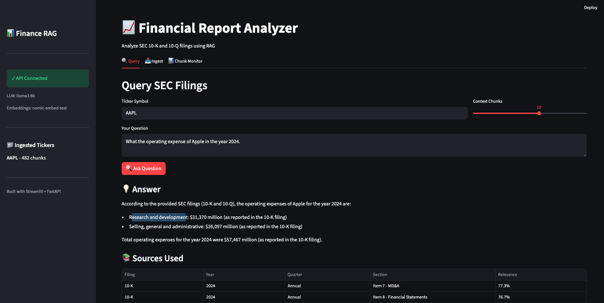

# 📊 Financial Report Researcher

> **Enterprise-grade RAG system for SEC 10-K and 10-Q filing analysis with local LLM inference**

[](https://www.python.org/downloads/)
[](https://fastapi.tiangolo.com/)
[](https://www.trychroma.com/)
[](https://opensource.org/licenses/MIT)

A Retrieval-Augmented Generation (RAG) application that automatically downloads SEC EDGAR filings, processes them with semantic chunking, and enables natural language querying through locally-hosted LLMs via Ollama.



---

## ✨ Key Features

| Feature | Description |
|---------|-------------|
| **🔄 Automated SEC Download** | Fetches 10-K and 10-Q filings directly from SEC EDGAR with 2-year lookback |
| **🧠 Semantic Chunking** | Section-aware processing (MD&A, Risk Factors, Financial Statements) |
| **🔒 100% Local** | No data leaves your machine - embeddings and LLM run via Ollama |
| **📊 Chunk Monitoring** | See exactly which filing sections are retrieved for each query |
| **⚡ REST API** | FastAPI backend with streaming support and OpenAPI docs |
| **🖥️ Streamlit GUI** | User-friendly interface for ingestion, querying, and monitoring |

---

## 🏗️ Architecture

```
┌─────────────────────────────────────────────────────────────────────────────┐
│                          Financial Report Analyzer                          │
├─────────────────────────────────────────────────────────────────────────────┤
│                                                                             │
│  ┌───────────────┐    ┌──────────────────┐    ┌───────────────────────┐     │
│  │  Streamlit    │    │   FastAPI        │    │   SEC EDGAR           │     │
│  │  Frontend     │───▶│   Backend        │───▶│   (Data Source)       │     │
│  │  (Port 8501)  │    │   (Port 8000)    │    │                       │     │
│  └───────────────┘    └──────────────────┘    └───────────────────────┘     │
│         │                      │                                            │
│         │                      ▼                                            │
│         │             ┌──────────────────┐                                  │
│         │             │ Document         │                                  │
│         │             │ Processor        │                                  │
│         │             │ (Semantic Chunk) │                                  │
│         │             └──────────────────┘                                  │
│         │                      │                                            │
│         ▼                      ▼                                            │
│  ┌───────────────┐    ┌──────────────────┐    ┌───────────────────────┐     │
│  │  Query        │    │   ChromaDB       │    │   Ollama              │     │
│  │  Engine       │◀──▶│   Vector Store   │◀──▶│   (Embeddings + LLM)  │     │
│  │  (RAG)        │    │   (Persistent)   │    │   (Port 11434)        │     │
│  └───────────────┘    └──────────────────┘    └───────────────────────┘     │
│                                                                             │
└─────────────────────────────────────────────────────────────────────────────┘
```

---

## 🚀 Quick Start

### Prerequisites

- **Python 3.10+** (3.13 recommended)
- **Ollama** - Install from [ollama.ai](https://ollama.ai)

### 1. Clone and Setup

```bash
# Clone the repository
cd "/Volumes/T7 SHIELD/Finance report analyzer"

# Create virtual environment
python3 -m venv venv
source venv/bin/activate

# Install dependencies
pip install -r requirements.txt

# Configure environment
cp .env.example .env
```

### 2. Pull Ollama Models

```bash
ollama pull nomic-embed-text    # Embeddings (274 MB)
ollama pull llama3:8b           # LLM (4.7 GB)
```

### 3. Start the Services

```bash
# Terminal 1: Start API Server
source venv/bin/activate
uvicorn api.main:app --reload --port 8000

# Terminal 2: Start Streamlit GUI
source venv/bin/activate
streamlit run streamlit_app.py
```

### 4. Open the App

- **Streamlit GUI**: http://localhost:8501
- **API Docs**: http://localhost:8000/docs

---

## 📖 Usage

### Via Streamlit GUI

1. **Ingest Tab**: Enter ticker (e.g., `AAPL`) and reference date
2. **Query Tab**: Ask natural language questions about the filings
3. **Chunk Monitor**: View retrieved sources and relevance scores

### Via REST API

#### Ingest Filings
```bash
curl -X POST http://localhost:8000/ingest \
  -H "Content-Type: application/json" \
  -d '{"ticker": "AAPL", "reference_date": "2025-01-15"}'
```

#### Query Filings
```bash
curl -X POST http://localhost:8000/query \
  -H "Content-Type: application/json" \
  -d '{
    "ticker": "AAPL",
    "query": "What was the operating expense in fiscal year 2024?",
    "top_k": 5
  }'
```

---

## 🔧 Configuration

Edit `.env` to customize:

```bash
# SEC EDGAR (Required for API compliance)
SEC_USER_AGENT=YourCompany your.email@example.com

# Ollama Settings
OLLAMA_HOST=http://localhost:11434
OLLAMA_LLM_MODEL=llama3:8b
OLLAMA_EMBED_MODEL=nomic-embed-text

# Storage Paths
CHROMA_DB_PATH=./data/chroma_db
FILINGS_CACHE_PATH=./data/filings
```

---

## 🗂️ Project Structure

```
├── api/
│   ├── main.py              # FastAPI application & endpoints
│   └── schemas.py           # Pydantic request/response models
├── src/
│   ├── config.py            # Configuration & environment variables
│   ├── sec_downloader.py    # SEC EDGAR API integration
│   ├── document_processor.py # Semantic chunking pipeline
│   ├── embeddings.py        # Ollama embedding generation
│   ├── vector_store.py      # ChromaDB operations
│   ├── llm_interface.py     # Ollama LLM client
│   └── query_engine.py      # RAG orchestration
├── data/
│   ├── filings/             # Cached SEC filings (auto-created)
│   └── chroma_db/           # Vector database (auto-created)
├── streamlit_app.py         # Streamlit GUI application
├── requirements.txt         # Python dependencies
├── .env.example             # Environment template
└── README.md
```

---

## 📊 API Reference

| Endpoint | Method | Description |
|----------|--------|-------------|
| `/health` | GET | System health check (Ollama, ChromaDB status) |
| `/ingest` | POST | Download and vectorize SEC filings |
| `/query` | POST | RAG query with source attribution |
| `/query/stream` | POST | Streaming RAG response |
| `/collections` | GET | List all ingested tickers |
| `/collections/{ticker}` | GET | Get collection statistics |
| `/collections/{ticker}` | DELETE | Remove ticker data |

Full OpenAPI documentation available at `/docs` when server is running.

---

## 💡 Example Queries

```
"What was Apple's total revenue in fiscal year 2024?"
"Compare R&D expenses in Q2 2024 vs Q2 2023"
"Summarize the key risk factors from the latest 10-K"
"What was the YoY growth in operating income?"
"What are the main differences between 2023 and 2024 annual reports?"
"Explain the company's revenue recognition policy"
```

---

## 🔬 Technical Details

### Chunking Strategy

| Filing Section | Min Chunk Size | Rationale |
|----------------|----------------|-----------|
| **Item 7 (MD&A)** | 2,500 chars | Preserves narrative context for analysis |
| **Item 1 (Business)** | 1,500 chars | Maintains company description coherence |
| **Other Sections** | 1,000 chars | Balances granularity and context |

### Model Configuration

| Component | Model | Dimensions | Notes |
|-----------|-------|------------|-------|
| **Embeddings** | nomic-embed-text | 768 | 137M parameters, optimized for retrieval |
| **LLM** | llama3:8b | - | Low temperature (0.1) for factual accuracy |

### Performance Considerations

- **Embedding Generation**: ~50-100ms per chunk
- **Query Latency**: 2-5s depending on context size
- **Storage**: ~1-2 MB per filing (vectorized)

---

## 🛠️ Development

### Run Tests
```bash
pytest tests/ -v
```

### Type Checking
```bash
mypy src/ api/
```

---

## 📄 License

This project is licensed under the MIT License - see the [LICENSE](LICENSE) file for details.

---

## 🙏 Acknowledgments

- [SEC EDGAR](https://www.sec.gov/edgar) for public filing data
- [Ollama](https://ollama.ai) for local LLM infrastructure
- [ChromaDB](https://www.trychroma.com/) for vector storage
- [FastAPI](https://fastapi.tiangolo.com/) for the API framework
- [Streamlit](https://streamlit.io/) for the frontend framework
